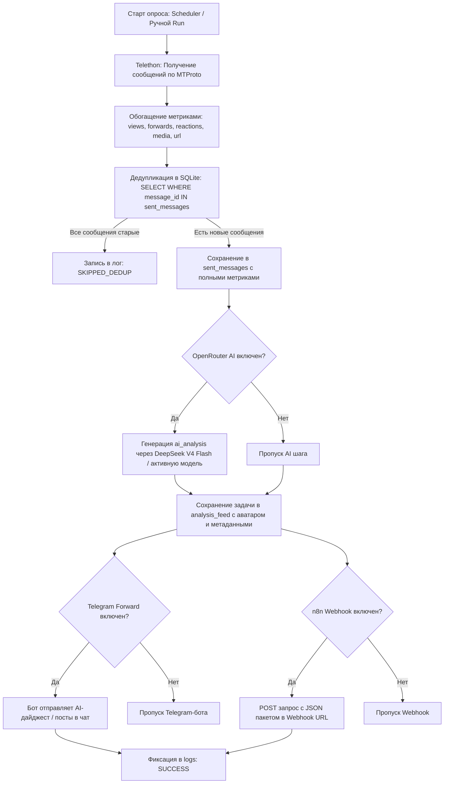

# 📘 Telegram Monitor & n8n Bridge — Полное руководство по архитектуре и воссозданию проекта с нуля

## 📌 1. Обзор и концепция проекта

**Telegram Monitor & n8n Bridge** — это производительный сервис для мониторинга Telegram-каналов через официальный протокол **MTProto (User API)**, интеллектуальной фильтрации контента с помощью LLM (OpenRouter / DeepSeek V4 Flash), визуализации задач в интерактивной **Ленте (Live Feed)**, прямой пересылки дайджестов через Telegram-бота и оркестрации событий в сценарии **n8n**.

### Ключевые возможности:
* **MTProto Мониторинг:** Чтение любых публичных и приватных каналов, в которых состоит пользовательский аккаунт (без ограничений обычных Bot API).
* **Сбор полных метрик постов:** Просмотры (`views`), детальные реакции (`reactions` с эмодзи и счетчиками), пересылки (`forwards`), наличие медиа (`has_media`), прямые ссылки (`post_url`).
* **Гарантированная дедупликация:** Защита от повторной отправки одинаковых сообщений через локальную базу данных SQLite (`sent_messages`).
* **Интерактивная «Лента» (Live Feed Master-Detail):**
  * Двухколоночный интерфейс: слева список выполненных задач анализа с аватарами каналов, метриками и превью; справа — полный Markdown-разбор сгенерированного AI Summary и инспектор исходных постов Telegram.
  * Кнопка **«🔄 Обновить анализ»** прямо в задаче: возможность перезапустить анализ сохраненной выборки через LLM с актуальным системным промптом канала.
  * Фоновый Live Polling каждые 8 секунд без перезагрузки страницы.
* **Гибкая независимая диспетчеризация:** Возможность раздельно включать/выключать:
  1. Отправку в **n8n Webhook**.
  2. Отправку в **Telegram-бота** (в личку или канал).
  3. AI-обработку через **OpenRouter (по умолчанию `deepseek/deepseek-v4-flash`)**.
* **Автономный фоновый планировщик:** Периодический опрос каналов с индивидуальными интервалами, лимитами и системными промптами.
* **Автоматическая очистка базы:** Фоновая ежедневная очистка устаревших логов и записей сообщений по настраиваемому сроку (7, 14, 30, 60, 90 дней).
* **Премиальный SPA UI (60 FPS, Anti-Slop):** Легкий интерфейс без тяжелых фреймворков, с микроанимациями **GSAP 3**, единой типографикой (`font-variant-numeric: tabular-nums`), поддержкой Markdown-форматирования и мгновенным автосохранением параметров в SQLite.

---

## 🛠️ 2. Технологический стек

| Слой | Технология | Назначение |
|---|---|---|
| **Backend Runtime** | Python 3.10+ / 3.11+ | Основной язык серверной логики |
| **Веб-фреймворк** | FastAPI (0.115+) & Uvicorn (0.34+) | Асинхронный REST API и хостинг статики |
| **Telegram MTProto Client** | Telethon (1.38+) | Прямое подключение к серверам Telegram по MTProto |
| **Сетевой клиент** | HTTPX (0.28+) | Асинхронные HTTP-запросы (OpenRouter, n8n Webhook, Bot API) |
| **База данных** | SQLite 3 (`storage.db`) | Хранение настроек, каналов, истории сообщений, ленты и логов |
| **Валидация данных** | Pydantic (2.10+) | Типизация и валидация входящих JSON-запросов |
| **Frontend UI** | HTML5, CSS3 Tokens, Vanilla JS (SPA) | Монолитный легковесный интерфейс управления |
| **Анимации и микро-UX** | GSAP 3.12.5 | 60fps аппаратные анимации табов, модалок, карточек и ленты |
| **Контейнеризация** | Docker / Docker Compose / Railway | Развертывание в изолированном контейнере |

---

## 📁 3. Структура файлов и каталогов

```
Teleton/
├── server.py                 # Центральный сервер: FastAPI, MTProto, Планировщик, Диспетчер, API
├── requirements.txt          # Python-зависимости
├── Dockerfile                # Сборка Docker-контейнера
├── Procfile                  # Конфигурация для Railway / Heroku
├── railway.json              # Деплой-конфигурация Railway
├── .env.example              # Шаблон переменных окружения
├── .env                      # Локальные переменные окружения (API ID, Hash)
├── personal_account.session  # Файл сессии Telethon MTProto (генерируется при входе)
├── storage.db                # SQLite база данных (создается автоматически)
├── static/
│   └── index.html            # SPA интерфейс со стилями CSS и логикой JS (GSAP 3)
└── PROJECT_OVERVIEW.md       # Это архитектурное руководство
```

---

## 🗄️ 4. Архитектура базы данных (SQLite: `storage.db`)

База данных инициализируется автоматически при старте `server.py` и содержит 6 таблиц:

### 1. `settings` (Системные настройки)
| Поле | Тип | Описание |
|---|---|---|
| `key` | TEXT PRIMARY KEY | Ключ параметра (`webhook_url`, `auto_webhook_enabled`, `auto_cleanup_enabled`, `auto_cleanup_days`, `auto_cleanup_last_run`) |
| `value` | TEXT | Значение параметра |

### 2. `monitors` (Отслеживаемые каналы)
| Поле | Тип | Описание |
|---|---|---|
| `id` | TEXT PRIMARY KEY | Уникальный строковый UUID (например `e798a20d`) |
| `chat_target` | TEXT | Юзернейм или ID канала (например `@theyseeku` или `-1001143063102`) |
| `chat_id` | INTEGER | Числовой ID чата Telegram |
| `chat_title` | TEXT | Название канала |
| `chat_username` | TEXT | Юзернейм канала без `@` |
| `interval_minutes` | INTEGER | Интервал автоопроса в минутах (по умолчанию 60) |
| `limit_count` | INTEGER | Количество запрашиваемых постов за раз (по умолчанию 20) |
| `offset_hours` | INTEGER | Опциональное временное окно выборки в часах (`NULL` = без отсечения) |
| `is_active` | INTEGER | 1 = активен, 0 = на паузе |
| `last_checked` | TEXT | ISO-дата последней проверки планировщиком |
| `last_sent_message_id`| INTEGER | Максимальный ID отправленного сообщения |
| `prompt` | TEXT | Индивидуальный системный промпт для LLM анализа постов этого канала |

### 3. `analysis_feed` (История выполненных задач анализа)
| Поле | Тип | Описание |
|---|---|---|
| `id` | INTEGER PRIMARY KEY AUTOINCREMENT | ID карточки в Ленте |
| `chat_id` | INTEGER | Числовой ID канала |
| `chat_title` | TEXT | Название канала |
| `chat_username` | TEXT | Юзернейм канала |
| `messages_count` | INTEGER | Количество постов в этой выборке |
| `raw_messages_json` | TEXT | Полный JSON-массив исходных сообщений со всеми метаданными |
| `ai_analysis` | TEXT | Текст сводки/анализа, сгенерированный LLM |
| `model_name` | TEXT | Использованная модель (по умолчанию `deepseek/deepseek-v4-flash`) |
| `photo_base64` | TEXT | Аватарка канала в формате `data:image/jpeg;base64,...` |
| `created_at` | TEXT | ISO-дата создания задачи |

### 4. `sent_messages` (История сообщений и дедупликация)
| Поле | Тип | Описание |
|---|---|---|
| `id` | INTEGER PRIMARY KEY AUTOINCREMENT | Внутренний ID записи в SQLite |
| `chat_id` | INTEGER | ID канала в Telegram |
| `message_id` | INTEGER | Оригинальный ID сообщения в Telegram |
| `date` | TEXT | Дата публикации сообщения в Telegram |
| `sender` | TEXT | Имя автора или название канала |
| `text` | TEXT | Полный текст сообщения |
| `views` | INTEGER | Количество просмотров поста |
| `forwards` | INTEGER | Количество пересылок поста |
| `has_media` | INTEGER | 1 = есть вложение/фото/видео, 0 = только текст |
| `reactions_count` | INTEGER | Общее количество реакций |
| `reactions_json` | TEXT | JSON-массив объектов реакций: `[{"emoji": "🔥", "count": 5}]` |
| `post_url` | TEXT | Прямая ссылка на пост (`https://t.me/c/.../123`) |
| `sent_at` | TEXT | Дата сохранения и отправки в SQLite |

> **Уникальный индекс:** `UNIQUE(chat_id, message_id)` — гарантирует невозможность дублирования записей одного и того же поста.

### 5. `logs` (Журнал событий)
| Поле | Тип | Описание |
|---|---|---|
| `id` | INTEGER PRIMARY KEY AUTOINCREMENT | ID события |
| `timestamp` | TEXT | Время события в ISO UTC |
| `event_type` | TEXT | Тип (`AUTH`, `FETCH`, `WEBHOOK_SENT`, `AI_ANALYSIS`, `AUTO_CLEANUP` и др.) |
| `details` | TEXT | Подробный текст описания |
| `status` | TEXT | Статус (`SUCCESS`, `ERROR`, `SKIPPED_DEDUP`, `INFO`) |
| `chat_title` | TEXT | Название канала (опционально) |
| `chat_id` | INTEGER | ID чата (опционально) |
| `messages_count` | INTEGER | Количество обработанных сообщений (опционально) |

### 6. `integrations_config` (Интеграции с OpenRouter и Telegram Bot)
| Поле | Тип | Описание |
|---|---|---|
| `id` | INTEGER PRIMARY KEY CHECK (id = 1) | Единственная строка конфигурации |
| `openrouter_api_key` | TEXT | API ключ OpenRouter |
| `openrouter_model` | TEXT | Имя модели (по умолчанию `deepseek/deepseek-v4-flash`) |
| `openrouter_base_url` | TEXT | Base URL API (по умолчанию `https://openrouter.ai/api/v1`) |
| `openrouter_enabled` | INTEGER | 1 = включен, 0 = выключен |
| `tg_bot_token` | TEXT | Токен Telegram-бота из @BotFather |
| `tg_sender_id` | TEXT | ID получателя дайджестов |
| `tg_forward_enabled` | INTEGER | 1 = включен, 0 = выключен |

---

## 🔄 5. Пайплайн обработки и доставки сообщений

При автоматическом срабатывании таймера или ручном нажатии кнопки **«⚡ Запустить»** выполняется следующая цепочка:



---

## 🌐 6. Спецификация REST API

### 🔑 Авторизация и профиль
* `GET /health` — проверка статуса MTProto клиента (online/offline, авторизованный пользователь).
* `GET /api/settings` — получение текущих API ID и API Hash.
* `POST /api/settings` — сохранение API ID и API Hash в `.env`.
* `POST /api/auth/send-code` — отправка SMS/кода подтверждения Telegram на номер телефона.
* `POST /api/auth/sign-in` — ввод кода из Telegram (и пароля 2FA при наличии).
* `POST /api/auth/logout` — завершение пользовательской сессии.

### 📡 Управление мониторами (Каналами)
* `GET /api/monitors` — список всех добавленных каналов с таймерами и параметрами.
* `POST /api/monitors` — добавление нового канала по `@username`, ссылке или ID.
* `PATCH /api/monitors/{id}` — обновление интервала, лимита, промпта или активности.
* `DELETE /api/monitors/{id}` — удаление канала из мониторинга.
* `POST /api/monitors/{id}/run` — немедленный опрос канала с доставкой новых постов.
* `POST /api/monitors/{id}/reset-dedup` — сброс истории отправленных сообщений для этого канала.
* `GET /dialogs` — получение списка всех доступных чатов пользовательского аккаунта.

### 📰 Интерактивная Лента (Live Feed)
* `GET /api/feed?limit=50` — получение списка выполненных задач анализа с пагинацией.
* `DELETE /api/feed/{id}` — удаление карточки задачи из ленты.
* `POST /api/feed/{id}/reanalyze` — повторный запуск LLM анализа для сохраненной выборки задачи с индивидуальным промптом канала.

### 💬 Сообщения
* `GET /api/messages?limit=100` — получение сохраненных сообщений со всеми метриками и реакциями.
* `POST /api/send-feed-to-n8n` — пакетная отправка отфильтрованных сообщений из таблицы в n8n.

### 🤖 Настройки интеграций
* `GET /api/webhook` / `POST /api/webhook` — получение и сохранение URL n8n Webhook и тоггла авто-отправки.
* `POST /api/webhook/test` — отправка тестового JSON-пакета в n8n.
* `GET /api/openrouter` / `POST /api/openrouter` — управление API ключом, моделью и тогглом OpenRouter.
* `GET /api/openrouter/models` — динамическая загрузка списка моделей с сервера OpenRouter.
* `POST /api/openrouter/test` — проверка работы AI на тестовом тексте.
* `GET /api/telegram-forward` / `POST /api/telegram-forward` — настройки бота для пересылки дайджестов в Telegram.
* `POST /api/telegram-forward/test` — отправка тестового сообщения через Telegram-бота.

### 🧹 Логи и автоочистка базы
* `GET /api/logs?limit=150&status=ALL` — получение системного журнала событий.
* `DELETE /api/logs` — полная очистка журнала логов.
* `GET /api/cleanup` — статус фоновой автоочистки базы.
* `POST /api/cleanup` — сохранение параметров автоочистки (`enabled`, `days`).
* `POST /api/cleanup/run-now` — принудительный запуск очистки базы прямо сейчас.

---

## 📦 7. Пошаговая инструкция по развертыванию с нуля

### Шаг 1. Клонирование репозитория и окружение
```bash
git clone https://github.com/Asmadey/telegram-monitor-n8n-bridge.git
cd telegram-monitor-n8n-bridge

# Создание и активация виртуального окружения Python
python3 -m venv .venv
source .venv/bin/activate  # На Windows: .venv\Scripts\activate

# Установка зависимостей
pip install -r requirements.txt
```

### Шаг 2. Получение Telegram API ID и API HASH
1. Перейдите на официальный портал разработчиков Telegram: [https://my.telegram.org](https://my.telegram.org).
2. Войдите под своим номером телефона.
3. Откройте раздел **«API development tools»**.
4. Создайте приложение (название любое, например `TelegramMonitor`).
5. Скопируйте `api_id` и `api_hash`.

### Шаг 3. Запуск сервера
```bash
python -m uvicorn server:app --host 127.0.0.1 --port 8000 --reload
```
Откройте браузер по адресу: **`http://127.0.0.1:8000`**.

### Шаг 4. Первичная настройка через веб-интерфейс
1. **Авторизация:** Введите номер телефона, получите код в Telegram и завершите вход (при необходимости введите пароль 2FA).
2. **Добавление каналов:** Перейдите во вкладку «Каналы», нажмите «➕ Добавить канал» и укажите `@username` или выберите из списка диалогов.
3. **Настройка n8n Webhook:** Вставьте URL вашего Webhook-узла в n8n во вкладке «Интеграция».
4. **Настройка OpenRouter (опционально):** Вставьте API-ключ OpenRouter, модель по умолчанию — `deepseek/deepseek-v4-flash`.
5. **Настройка Telegram-бота (опционально):** Вставьте токен бота из [@BotFather](https://t.me/BotFather) и ID вашего чата/канала в блоке «Отправка в Telegram».

---

## 🐳 8. Развертывание в Docker

### `Dockerfile`:
```dockerfile
FROM python:3.11-slim
WORKDIR /app
RUN apt-get update && apt-get install -y --no-install-recommends gcc && rm -rf /var/lib/apt/lists/*
COPY requirements.txt .
RUN pip install --no-cache-dir -r requirements.txt
COPY . .
EXPOSE 8000
CMD ["uvicorn", "server:app", "--host", "0.0.0.0", "--port", "8000"]
```

### Сборка и запуск контейнера:
```bash
docker build -t teleton-monitor .
docker run -d -p 8000:8000 -v $(pwd)/storage.db:/app/storage.db -v $(pwd)/personal_account.session:/app/personal_account.session --name teleton teleton-monitor
```

---

## 🧩 9. Пример JSON-пакета для n8n Webhook

При отправке в n8n на узел **Webhook** поступает валидный JSON следующей структуры:

```json
{
  "source": "telethon_monitor",
  "event": "telegram_messages_batch",
  "timestamp": "2026-08-29T21:00:00.000000+00:00",
  "chat_id": -1001143063102,
  "chat_title": "Finder.work: вакансии и удаленка",
  "chat_username": "theyseeku",
  "messages_count": 1,
  "messages": [
    {
      "id": 38115,
      "date": "2026-08-29T18:30:00+00:00",
      "sender": "Finder.work",
      "sender_id": -1001143063102,
      "is_outgoing": false,
      "text": "**Senior Fullstack Developer (Python + React)**\nот 350 000 ₽\nФормат: Удаленно...",
      "has_media": false,
      "views": 2450,
      "forwards": 18,
      "reactions_count": 12,
      "reactions": [
        { "emoji": "🔥", "count": 7 },
        { "emoji": "👍", "count": 5 }
      ],
      "post_url": "https://t.me/theyseeku/38115"
    }
  ],
  "ai_analysis": "📌 **Краткая выжимка постов:**\n- Открыта позиция Senior Fullstack разработчика с вилкой 350k ₽."
}
```

---

## 🎯 10. Рекомендации по поддержке и масштабированию
1. **Резервное копирование:** Регулярно сохраняйте файлы `storage.db` и `personal_account.session`.
2. **Лимиты Telegram (FloodWait):** Telethon автоматически обрабатывает задержки `FloodWaitError`, однако рекомендуется выставлять интервал опроса не менее 15–30 минут на канал.
3. **Безопасность:** В продакшн-среде закройте панель управления базовой HTTP-аутентификацией через Nginx или Reverse Proxy.

