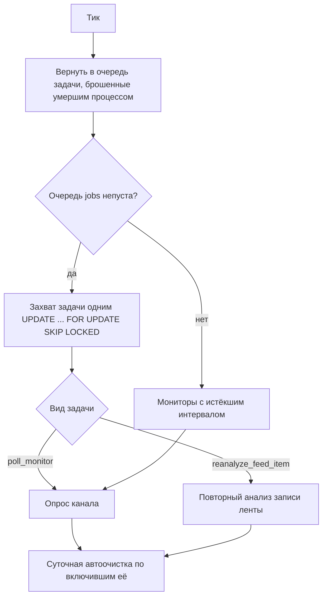
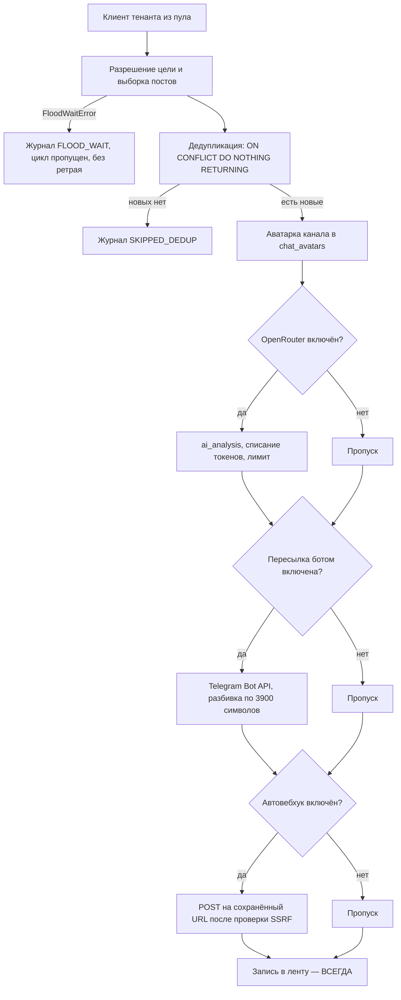

# 📘 Teleton — архитектура

Справочник по устройству приложения: модули, схема данных, пайплайн, API.
Установка и запуск — [README.md](README.md), правила работы —
[AGENTS.md](AGENTS.md), план и статус задач — [docs/PLAN.md](docs/PLAN.md),
деплой — [docs/DEPLOY.md](docs/DEPLOY.md).

---

## 1. Что это

Мульти-тенант SaaS: пользователь регистрируется, подключает **свой**
Telegram-аккаунт и мониторит каналы от его лица через MTProto (Telethon).
Новые посты дедуплицируются, при желании прогоняются через LLM и
доставляются в n8n-вебхук и Telegram-бота; история остаётся в ленте.

Определяющий факт: на сервере лежат **MTProto-сессии чужих аккаунтов**. Их
нельзя сбросить удалённо, и они дают полное чтение переписки. Поэтому
изоляция тенантов, шифрование секретов и «закрыто по умолчанию» — не
гигиена, а суть задачи.

---

## 2. Два процесса

Из одного Docker-образа поднимаются две команды. Разделение обязательно:
второй процесс на том же MTProto auth-key даёт `AUTH_KEY_DUPLICATED`, и
Telegram может убить сессию пользователя.

| Процесс | Команда | Ответственность | Telethon |
|---|---|---|---|
| `web` | `uvicorn app.main:app --host 0.0.0.0 --port $PORT` | HTTP, аутентификация, вход в Telegram | короткоживущий клиент только на время авторизации |
| `worker` | `python -m app.worker` | очередь, расписание, доставка, автоочистка | единственный владелец пула долгоживущих клиентов |

---

## 3. Карта модулей

```
app/
├── main.py                 сборка FastAPI: middleware, роутеры, страницы
├── config.py               pydantic-settings, ЕДИНСТВЕННАЯ точка чтения ENV
├── db.py                   async engine, sessionmaker, TenantRepo
├── deps.py                 require_user / require_admin / get_tenant_repo
├── worker.py               цикл воркера: очередь → расписание → автоочистка
├── models/                 13 таблиц; user_id NOT NULL + индекс в тенантных
├── security/
│   ├── passwords.py        bcrypt
│   ├── sessions.py         сессии в БД + подписанная httpOnly-cookie
│   ├── password_reset.py   одноразовый токен (в подпись входит password_hash)
│   ├── crypto.py           Fernet: шифрование секретов, отказ старта без ключа
│   ├── csrf.py             double-submit token на все не-GET
│   ├── cookies.py          SameSite по «один ли это сайт» (Public Suffix List)
│   ├── cors.py             список origin из настроек; `*` + credentials невозможен
│   ├── headers.py          CSP, HSTS, nosniff, frame-options, referrer-policy
│   └── ratelimit.py        slowapi: логин, регистрация, сброс, код Telegram
├── api/                    роутеры: auth, admin, public, telegram, monitors,
│                           feed, journal, integrations, checks, cleanup
└── services/
    ├── tg_pool.py          пул клиентов: LRU, лимит, простой, FloodWait
    ├── tg_gateway.py       граница с Telegram для воркера (в тестах — двойник)
    ├── tg_auth.py          вход по коду, состояние попытки в БД
    ├── tg_account.py       сохранение StringSession зашифрованной
    ├── messages.py         выборка постов канала с метриками
    ├── dedup.py            INSERT ... ON CONFLICT DO NOTHING RETURNING
    ├── jobs.py             очередь: захват SKIP LOCKED, зависшие задачи
    ├── dispatch.py         AI → бот → n8n → лента
    ├── llm.py              OpenRouter: обрезка, месячный лимит, автоотключение
    ├── webhook.py          отправка с проверкой SSRF по резолвнутому IP
    ├── integrations.py     секреты (шифрование) и настройки (белый список)
    ├── journal.py          add_log с затиранием секретов (redact)
    ├── cleanup.py          удаление данных старше N дней
    ├── mailer.py           письма сброса (dev — в файл)
    └── google_auth.py      верификация Firebase ID-токена

static/                     ванильный SPA на ES-модулях, без сборки
├── index.html              разметка без логики
├── login.html / signup.html / password-reset.html
├── css/main.css
└── js/  api.js render.js auth.js main.js
      feed.js channels.js messages.js integration.js logs.js auth-pages.js

alembic/versions/           миграции — единственный способ менять схему
scripts/migrate_sqlite_to_pg.py   разовый перенос из старой SQLite
tests/                      статические (разбор исходников) + поведенческие
```

---

## 4. Схема данных (PostgreSQL)

Тринадцать таблиц. В каждой тенантной — `user_id NOT NULL` с индексом и
внешним ключом; правило держит `tests/test_12_models.py`, а запросы идут
через `TenantRepo`, где забыть фильтр невозможно.

| Таблица | Назначение | Заметки |
|---|---|---|
| `users` | учётные записи | `password_hash` nullable — вход может быть только через Google |
| `identities` | связка с внешним провайдером | `(provider, provider_uid)`; вход через Google привязывается к существующему email, а не создаёт дубль |
| `sessions` | сессии пользователей | отзыв = удаление строки (JWT так не умеет) |
| `telegram_accounts` | подключённый Telegram | `session_string_encrypted` — Fernet; файлов `.session` нет |
| `tg_auth_attempts` | незавершённый вход по коду | заменяет глобальный `auth_state`: TTL, привязка к пользователю |
| `monitors` | каналы мониторинга | `public_id` наружу; уникален **в паре** с `user_id` |
| `sent_messages` | история отправленного | `UNIQUE(user_id, chat_id, message_id)` — на нём стоит дедупликация |
| `feed_items` | лента выполненных заданий | без `photo_base64`: аватарки вынесены |
| `chat_avatars` | аватарка канала | без `user_id` — фото публичного канала одно на всех; изоляция на чтении |
| `logs` | журнал событий | `details` проходит `redact` перед записью |
| `integrations` | n8n / OpenRouter / бот / автоочистка | секреты только в `*_encrypted` |
| `jobs` | очередь ручных запусков | `status`, `started_at`, `error` |
| `llm_usage` | израсходованные токены за период | основание для месячного лимита |

Схема меняется **только** миграцией Alembic. `ALTER TABLE` в коде приложения
запрещён и проверяется тестом: прежний монолит мигрировал схему шестью
блоками `try: ALTER TABLE except: pass`, где ошибка проглатывалась молча.

---

## 5. Пайплайн

Тик воркера — каждые 30 секунд:



Опрос одного канала:



Последний шаг подчёркнут намеренно: в монолите успешная отправка вебхука
делала `return` до записи в ленту, поэтому история наполнялась только у тех,
у кого n8n выключен или падает. Лента — журнал выполнения, а не запасной
путь доставки.

---

## 6. REST API

Всё, кроме явно публичного, требует сессии: зависимость `require_user`
висит на роутере целиком, а публичные маршруты перечисляются отдельным
списком. Забыть закрыть эндпоинт нельзя — можно забыть открыть, и это
видно сразу (`tests/test_22_auth_required.py` перебирает все маршруты).
Обращение к чужому ресурсу — **404, не 403**: 403 подтверждает, что объект
существует.

### Публичное

* `GET /health` — `{"status": "ok"}` и ничего больше.
* `GET /`, `/feed`, `/channels`, `/messages`, `/integration`, `/logs` — страницы SPA.
* `GET /login`, `/signup`, `/password-reset` — страницы входа.

### Аутентификация

* `POST /auth/signup` — регистрация, сразу сессия.
* `POST /auth/login` — вход (10 попыток / 3 мин на IP).
* `POST /auth/logout` — удаление строки сессии.
* `GET /auth/me` — текущий пользователь или 401.
* `POST /auth/password-reset` — запрос письма; ответ **одинаков** для
  существующего и несуществующего email (иначе это перечислитель пользователей).
* `POST /auth/password-reset/confirm` — смена пароля по одноразовому токену.
* `POST /auth/google` — вход по Firebase ID-токену; выдаётся своя cookie-сессия.

### Telegram

* `POST /api/telegram/send-code` — код на телефон (**3 / час на пользователя**:
  это защита аккаунта клиента, Telegram ограничивает тех, кому часто шлют коды).
* `POST /api/telegram/sign-in` — код и пароль 2FA.
* `POST /api/telegram/logout` — отключение аккаунта.
* `GET /api/telegram/dialogs` — список собственных чатов.

### Мониторы

* `GET /api/monitors`, `POST /api/monitors`
* `PATCH /api/monitors/{public_id}`, `DELETE /api/monitors/{public_id}`
* `POST /api/monitors/{public_id}/run` — **202**: задача ставится в очередь,
  опрос делает воркер (монолит держал HTTP-запрос всё время опроса).
* `POST /api/monitors/{public_id}/reset-dedup` — сброс истории канала.

### Лента и сообщения

* `GET /api/feed`, `GET /api/feed/{id}`, `DELETE /api/feed/{id}`, `DELETE /api/feed`
* `POST /api/feed/{id}/reanalyze` — **202**, повторный анализ задачей.
* `GET /api/avatars/{chat_id}` — картинка с `Cache-Control`.
* `GET /api/messages` — сохранённые посты с метриками.

### Интеграции и проверки

* `GET|POST /api/webhook`, `POST /api/webhook/test`
* `GET|POST /api/openrouter`, `GET /api/openrouter/models`, `POST /api/openrouter/test`
* `GET|POST /api/telegram-forward`, `POST /api/telegram-forward/test`

GET-ответы отдают **только** маску и признак `has_*` — сырых ключей в
ответах нет (`tests/test_01_no_secret_leak.py` проверяет это разбором AST).
Отсутствующее поле в POST не затирает сохранённый секрет, явная пустая
строка — очищает.

### Журнал и автоочистка

* `GET /api/logs`, `DELETE /api/logs` — очистка **только своего** журнала.
* `GET|POST /api/cleanup`, `POST /api/cleanup/run-now` — 7/14/30/60/90 дней.

### Админка

* `GET /api/admin/users`, `GET /api/admin/users/{user_id}` — обычному
  пользователю 403, анониму 401.

### Не перенесено из монолита намеренно

* `GET|POST /api/settings` — ключи MTProto теперь только из окружения:
  прежний POST переписывал `.env` целиком, а на Railway ФС эфемерна.
* `POST /api/webhook/send-payload` — открытый прокси во внутреннюю сеть.
  Отсутствие эндпоинта держит трипваер-тест.

---

## 7. Формат вебхука

См. [README.md](README.md#-формат-вебхука-в-n8n).

---

## 8. Тесты

Два уровня. **Статический** разбирает исходники, конфиги и схему — работает
где угодно и ловит целые классы дефектов навсегда (секрет в ответе,
неэкранированная подстановка, DDL в коде). **Поведенческий** требует живого
Postgres; при его отсутствии обязан писать `pytest.skip` — тест, зеленеющий
без базы, хуже отсутствующего.

Внешние границы инъектируются: Telegram, OpenRouter, n8n и Firebase в
тестах заменяются двойниками, а autouse-страж в `conftest.py` режет любой
исходящий HTTP — тест, случайно ушедший в сеть, падает, а не тратит деньги.

---

## 9. Что уже стоило времени

Список ограничений, каждое из которых закрыто тестом, — в
[AGENTS.md](AGENTS.md), раздел 11. Читать до правок: там `.gitignore` ≠
`.dockerignore`, окно между `SELECT` и `INSERT`, бесполезность проверки
SSRF по имени хоста, пустая строка ≠ «не задано», 403 вместо 404 как
утечка, `break` по временному окну на закреплённом посте и невозможность
ротации ключа шифрования «на живую».
