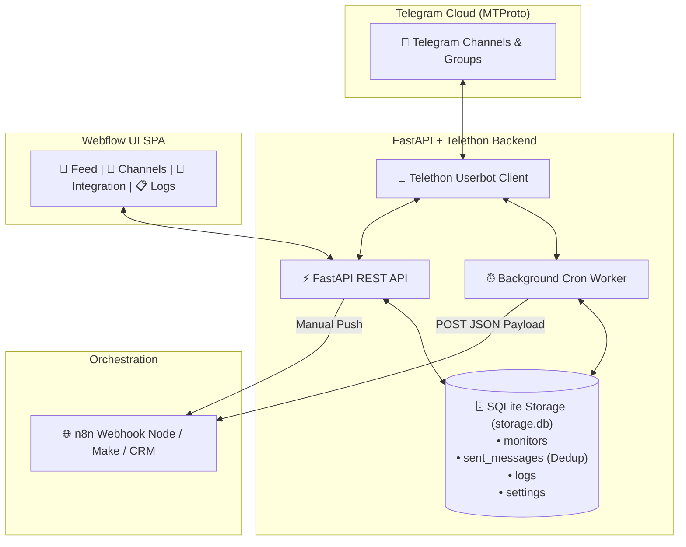

# 🚀 Telegram MTProto Monitor & n8n Automation Bridge

> **Enterprise Userbot & Webhook Orchestrator** на базе **FastAPI + Telethon (MTProto) + SQLite** с премиальным веб-интерфейсом в стиле **Webflow Design System**.

---

## 📌 Что делает этот проект?

Данный сервис позволяет автоматизировать мониторинг открытых и закрытых Telegram-каналов, групп и чатов от лица вашего реального аккаунта (через нативный протокол **MTProto / Userbot**), исключать дубликаты сообщений и автоматически отправлять свежие посты в **n8n / Make / Webhooks** по гибкому расписанию (Cron).

### 🌟 Ключевые возможности

1. **🔐 Веб-авторизация MTProto без консоли:**
   * Пошаговый мастер авторизации прямо в браузере: ввод номера телефона ➔ получение кода в Telegram ➔ ввод пароля 2FA (двухфакторная аутентификация).
   * Возможность смены ключей `API_ID` / `API_HASH` и выхода из аккаунта.

2. **📡 Многоканальный мониторинг с индивидуальным расписанием:**
   * Добавление любых источников: по `@username`, ссылке `https://t.me/...` или числовому ID чата (`-100...`).
   * Интерактивный диалог выбора источников из ваших личных диалогов и подписок в Telegram.
   * Индивидуальный интервал опроса для каждого канала (15 мин, 30 мин, 1 час, 2 часа, 6 часов, 24 часа).
   * Лимиты постов на опрос (от 1 до 100).
   * Динамический расчет времени следующей отправки (`⏳ След. отправка: 17:45 (через 15 мин)`).
   * Быстрое редактирование интервалов и лимитов на лету.

3. **🛡️ 100% Защита от дубликатов (Smart Deduplication):**
   * Все отправленные посты фиксируются в локальной базе данных **SQLite (`storage.db`)**.
   * При каждом плановом или ручном запуске в n8n отправляются **только новые, ранее не отправлявшиеся сообщения**.
   * Защита от спама пустыми вебхуками.
   * Кнопка сброса истории дедубликации по конкретному каналу.

4. **🧹 Умная фильтрация контента:**
   * **Автоматическое отсечение пустого медиа-мусора:** стикеры, системные уведомления и «голые» картинки без текста не засоряют ленту и не отправляются на вебхук.
   * **Поддержка медиа-подписей (Captions):** посты с фото/видео и текстом сохраняются полностью, с бейджем `📎 Медиа`.

5. **❤️ Сбор реакций и просмотров:**
   * Считывание суммарного числа реакций (`reactions_count`) и их детализация по эмодзи (`reactions`).
   * Считывание просмотров (`views`) и репостов (`forwards`).
   * Фильтры по минимальным просмотрам/реакциям и сортировка по популярности.

6. **🔗 n8n Webhook Bridge:**
   * Изолированная отправка вебхуков по каждому уникальному каналу.
   * Проверка связи (Тестовый вебхук).
   * Ручная отправка таблицы с группировкой по каналам.
   * Встроенный просмотрщик и экспорт массива в JSON.

7. **📋 Встроенный журнал логов (SQLite Audit Log):**
   * Фиксация всех событий (`WEBHOOK_SENT`, `SCHEDULER_POLL`, `SKIPPED_DEDUP`, `AUTH`, `SETTINGS`, `ERROR`).
   * Фильтрация логов по статусам, просмотр деталей ошибок и очистка истории.

---

## 🏗️ Архитектура системы



---

## 📦 Формат данных, отправляемых в n8n

Каждый вебхук содержит информацию по конкретному каналу и массив новых сообщений:

```json
{
  "source": "telethon_monitor",
  "event": "telegram_messages_batch",
  "timestamp": "2026-08-29T15:20:00Z",
  "chat_id": 1143063102,
  "chat_title": "Finder.work: работа и вакансии",
  "chat_username": "theyseeku",
  "messages_count": 1,
  "messages": [
    {
      "id": 38115,
      "date": "2026-08-29T12:00:00+00:00",
      "sender": "Finder.work",
      "sender_id": -1001143063102,
      "is_outgoing": false,
      "text": "Ищем Python/AI разработчика...",
      "has_media": false,
      "views": 320,
      "forwards": 2,
      "reactions_count": 14,
      "reactions": [
        { "emoji": "🔥", "count": 10 },
        { "emoji": "👍", "count": 4 }
      ],
      "post_url": "https://t.me/theyseeku/38115"
    }
  ]
}
```

---

## 🚀 Быстрый старт

### 1. Клонирование репозитория
```bash
git clone https://github.com/Asmadey/telegram-monitor-n8n-bridge.git
cd telegram-monitor-n8n-bridge
```

### 2. Настройка виртуального окружения
```bash
python3 -m venv .venv
source .venv/bin/activate  # На Windows: .venv\Scripts\activate
pip install -r requirements.txt
```

### 3. Настройка переменных окружения (`.env`)
Создайте файл `.env` на основе `.env.example`:
```bash
cp .env.example .env
```
Заполните свои ключи приложения из [my.telegram.org](https://my.telegram.org):
```env
TELEGRAM_API_ID=12345678
TELEGRAM_API_HASH=abcdef0123456789abcdef0123456789
```
*(Также ключи можно ввести прямо в веб-интерфейсе в окне «⚙️ MTProto & Вход»).*

### 4. Запуск сервера
```bash
python -m uvicorn server:app --host 127.0.0.1 --port 8000 --reload
```

### 5. Открытие веб-интерфейса
Откройте браузер по адресу: **[http://127.0.0.1:8000](http://127.0.0.1:8000)**
* Интерактивная документация Swagger API доступна по адресу: **[http://127.0.0.1:8000/docs](http://127.0.0.1:8000/docs)**.

---

## 🔒 Безопасность

* Файлы сессий Telegram (`*.session`), ключи авторизации (`.env`, `key.md`) и база данных (`storage.db`) добавлены в `.gitignore` и **никогда не попадают в репозиторий**.
* Сессионные токены хранятся исключительно локально на вашей машине.

---

## 🛠️ Стек технологий

* **Backend:** Python 3.10+, FastAPI, Telethon (MTProto API), SQLite3, HTTPX, Pydantic v2.
* **Frontend:** Vanilla HTML5, Vanilla CSS3 (Webflow Design Tokens), Vanilla JS (ES6+ SPA).
* **Интеграция:** n8n Webhook trigger, REST API.

---

## 📄 Лицензия

MIT License. Свободно для использования в персональных и коммерческих автоматизациях.
